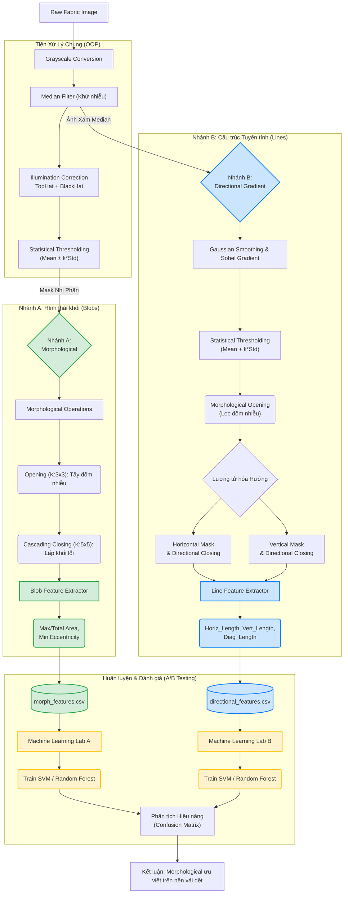

# Sơ đồ Luồng dữ liệu (Dataflow) - A/B Testing

Đây là sơ đồ kiến trúc hệ thống phản ánh chiến lược tách biệt 2 luồng xử lý (Morphological và Directional Gradient) để phục vụ cho việc huấn luyện Machine Learning và so sánh chéo hiệu năng phát hiện lỗi bề mặt vải.

## Diễn giải Sơ đồ

1. **Tiền xử lý chung:** Toàn bộ ảnh sẽ đi qua bộ lọc Trung vị (khử hạt) và phép biến đổi Top-Hat/Black-Hat để triệt tiêu hoàn toàn sự thiếu đồng đều của ánh sáng trên bề mặt vải.
2. **Nhánh A (Bên Trái):** Chuyên trách các lỗi dạng Đốm/Khối. Áp dụng Morphological (Opening/Closing) để lấp lỗ và tính toán Diện tích (Area), Chu vi (Perimeter). Đầu ra lưu vào tập dữ liệu riêng biệt `morph_features.csv`.
3. **Nhánh B (Bên Phải):** Chuyên trách các lỗi Xước/Đứt sợi. Thay thế Directional Gradient cũ bằng luồng Gradient Magnitude. Dùng đạo hàm Sobel kết hợp Ngưỡng thống kê để bắt lỗi tuyến tính. Sau đó dùng Lọc hình thái học có hướng (Directional Morphological) để nối liền vệt đứt gãy. Đầu ra đếm số pixel đứt gãy lưu vào `directional_features.csv`.
4. **Machine Learning:** Đưa 2 tập dữ liệu này vào huấn luyện độc lập. Cuối cùng, sinh ra 2 Ma trận nhầm lẫn (Confusion Matrix) để bảo vệ luận điểm khoa học trước hội đồng: Nhánh nào tối ưu cho loại khuyết tật nào.