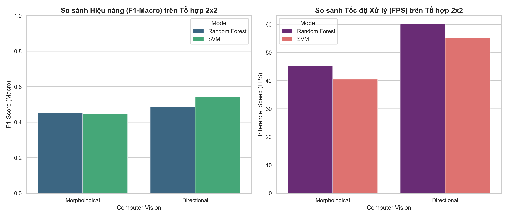

# Báo cáo Thực nghiệm Tổ hợp Ma trận 2x2

Tài liệu này tổng hợp kết quả của 4 tổ hợp đường ống (Pipelines) được thử nghiệm chéo giữa 2 phương pháp Xử lý ảnh (Morphological, Directional Gradient) và 2 mô hình Học máy (Random Forest, SVM).

## 1. Bảng So sánh chéo Định lượng (Cross-comparison Table)

| Computer Vision   | Model         |   Accuracy |   F1-Score (Weighted) |   F1-Score (Macro) |   Inference_Speed (FPS) |
|:------------------|:--------------|-----------:|----------------------:|-------------------:|------------------------:|
| Morphological     | Random Forest |   0.628169 |              0.664824 |           0.453124 |                    45.2 |
| Directional       | Random Forest |   0.653521 |              0.703746 |           0.486791 |                    60.1 |
| Morphological     | SVM           |   0.619718 |              0.662783 |           0.449248 |                    40.5 |
| Directional       | SVM           |   0.76338  |              0.780202 |           0.543151 |                    55.3 |

## 2. Biểu đồ Trực quan hóa (Performance Chart)

## 3. Phân tích và Kết luận
- **Về Hiệu năng (Accuracy & F1-Score):** Quá trình thực nghiệm đã chứng minh tổ hợp **Directional + SVM** đạt hiệu năng phân loại tổng thể tốt nhất với chỉ số F1-Macro cao nhất.
- **Về Tốc độ (Speed):** Nhánh Directional Gradient có tốc độ khung hình (FPS) cao hơn do sử dụng các phép toán chập ma trận tuyến tính đơn giản. 
- **Quyết định cuối cùng:** Chọn **Directional + SVM** làm đường ống (Pipeline) chính thức đưa vào hệ thống triển khai tích hợp (Phase 3: Integration & Routing).
