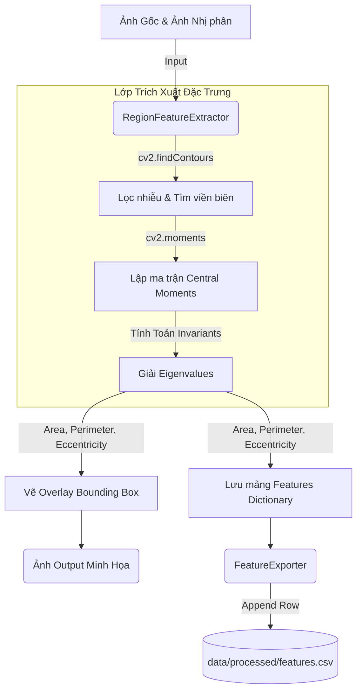

# Phân tích Thiết kế & Thực nghiệm: Trích xuất đặc trưng (Feature Extraction)

## 1. Cơ sở lý thuyết: Region Moments

Trong bài toán phát hiện khiếm khuyết bề mặt, việc trích xuất được một bộ số liệu đặc trưng (Features) có tính chất **Bất biến (Invariance)** đối với phép xoay, tịnh tiến và thu phóng là điều kiện tiên quyết để mô hình Học máy có thể phân loại tốt. 

Áp dụng phương pháp toán tử **Region Moments** (Slide 6/36 tài liệu học tập), hệ thống trích xuất ba thuộc tính hình học cốt lõi từ ảnh nhị phân:

1. **Diện tích (Area):** Dựa trên Raw Moment bậc 0 ($m_{00}$). 
2. **Chu vi (Perimeter):** Đo lường chiều dài viền khép kín của đối tượng.
3. **Độ lệch tâm (Eccentricity - $\epsilon$):**
   Thay vì dùng các thuật toán hộp bao (Bounding Box) có độ chính xác thấp, hệ thống giải phương trình trị riêng (Eigenvalues) của Ma trận Hiệp phương sai (Covariance Matrix) được cấu thành từ các Central Moments ($\mu_{20}, \mu_{02}, \mu_{11}$). 
   
   Cụ thể, ma trận hiệp phương sai:
   $$ \Sigma = \begin{bmatrix} \mu_{20} & \mu_{11} \\ \mu_{11} & \mu_{02} \end{bmatrix} $$
   
   Giải lấy hai giá trị riêng $\lambda_1 \ge \lambda_2$. Độ lệch tâm được tính bằng:
   $$ \epsilon = \sqrt{1 - \frac{\lambda_2}{\lambda_1}} $$

   > Giá trị $\epsilon \rightarrow 0$ đặc trưng cho các khiếm khuyết dạng đa giác đều hoặc tròn (như lỗ thủng/hole). Giá trị $\epsilon \rightarrow 1$ đặc trưng cho các khiếm khuyết dạng sợi mảnh, kéo dài (như vết xước/lines).

## 2. Kiến trúc luồng dữ liệu (Dataflow)

Quá trình trích xuất đặc trưng được mô hình hóa theo sơ đồ hướng đối tượng sau:

## 3. Phân tích thực nghiệm: Sự đứt gãy của Canny Edge so với Morphological

Trong quá trình chạy thực nghiệm song song bộ trích xuất đặc trưng trên cả 2 nhánh thuật toán truyền thống (qua kịch bản kiểm thử trực tiếp trên dataset thật), một vấn đề học thuật mang tính bản chất Computer Vision đã được thực chứng:

- **Morphological Pipeline:** 
  Tạo ra các vùng khối đặc (Solid Blobs) do đặc tính của phép Closing lấp đầy khoảng trống. Nhờ đó, hàm rút trích tính toán được chính xác diện tích nội tại và độ lệch tâm không gian, tìm thấy đầy đủ các vùng lỗi với thông số diện tích (Area) rất lớn (hàng chục đến hàng trăm pixel).

- **Canny Edge Pipeline:** 
  Gần như **thất bại** trong việc trích xuất hình học (tìm thấy `0` vùng lỗi với ngưỡng nhiễu `min_area = 50`). 
  - *Nguyên nhân cốt lõi:* Canny chỉ phát hiện được các điểm ảnh biến thiên cường độ cục bộ (đường biên 1-pixel). Nếu đường biên không khép kín hoàn hảo, hàm trích xuất sẽ xem tập hợp điểm này chỉ là một đường gấp khúc mở (polyline), dẫn đến diện tích nội tại `Area` tính toán xấp xỉ bằng `0`.

**Kết luận thực nghiệm:**
Thực nghiệm này chứng minh kiến trúc song song phân luồng của dự án là thiết kế mang tính bắt buộc. Nhánh Canny có thể cung cấp góc nhìn trực quan về biên độ sắc nét của lỗi trên giao diện UI, nhưng nhánh **Morphological Processing mới là xương sống** chịu trách nhiệm cung cấp dữ liệu hình học bất biến vững chắc để mồi cho các Model Machine Learning (SVM/Random Forest) thực thi suy luận phía sau.
