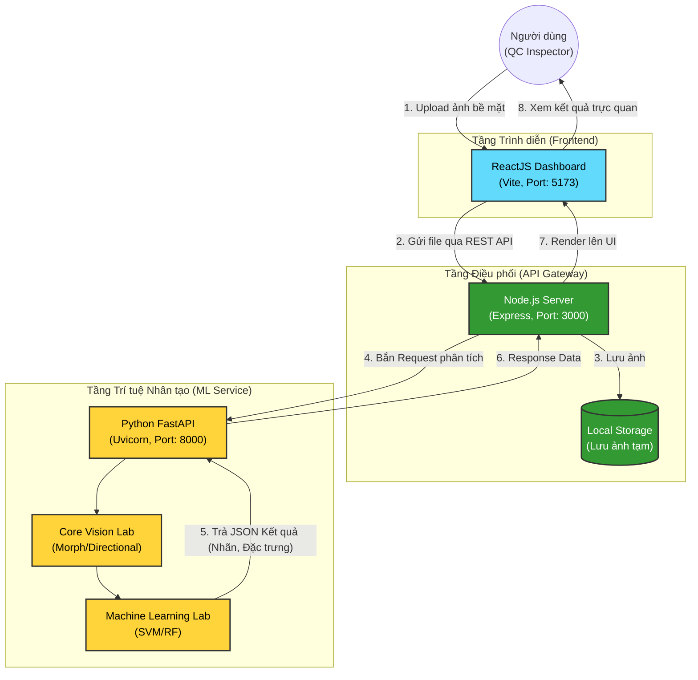

# Sơ đồ Kiến trúc Hệ thống Tổng thể (System Architecture)

Tài liệu này chứa sơ đồ khối mô tả kiến trúc phần mềm Client-Server của dự án (phục vụ cho Mục 2.1 của Báo cáo). 
Hệ thống được thiết kế theo kiến trúc Microservices đơn giản, phân tách rõ ràng trách nhiệm của từng tầng.

## Diễn giải Sơ đồ
1. **Tầng Frontend:** Giao diện người dùng được xây dựng bằng ReactJS. Đóng vai trò tương tác trực tiếp với nhân viên kiểm định (QC), cho phép họ tải ảnh lỗi lên và xem kết quả báo cáo trực quan.
2. **Tầng API Gateway (Node.js):** Đóng vai trò là trạm trung chuyển (Router) và quản lý tải trọng (Payload). Nó nhận file từ Frontend, lưu trữ tạm thời và gửi lệnh kích hoạt luồng AI bên dưới. Việc tách Node.js giúp Frontend không phải gọi trực tiếp vào lõi AI, tăng cường bảo mật và dễ dàng mở rộng Database (MongoDB/MySQL) sau này.
3. **Tầng ML Service (FastAPI):** Là "bộ não" của hệ thống viết bằng Python. FastAPI nhận ảnh từ Node.js, đẩy qua mảng Xử lý ảnh (Core Vision) để trích xuất đặc trưng, rồi đưa vào mô hình học máy (Machine Learning) để dự đoán. Kết quả cuối cùng được đóng gói thành JSON và trả ngược về chuỗi.
